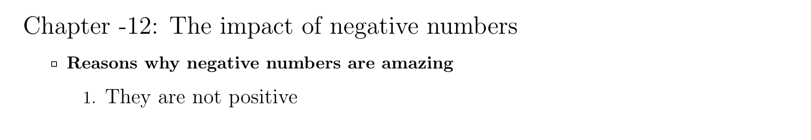

<p align="center">
<h2>Noted</h2><a href="" alt="version"> </a>
</p>

---

LaTeX document class for taking notes  
#### _From:_
```latex
{\Large Chapter -12: The impact of negative numbers}
\begin{itemize}
	\item \textbf{Reasons why negative numbers are amazing}
	\begin{enumerate}
		\item {\large They are not positive}
	\end{enumerate}
\end{itemize}
```
#### _To:_
```latex
\1{Chapter -12: The impact of negative numbers}\{
	\> \b{Reasons why negative numbers are amazing}\[
		\> \2{large They are not positive}
	\]
\}
```
#### Output:


### Cheatsheet
From | To
:----:|:----:
```\textbf{}```| ```\b{}``` 
```\textit{}```| ```\i{}``` 
```\underline{}```| ```\u{}``` 
``` ... ``` | ```...```
